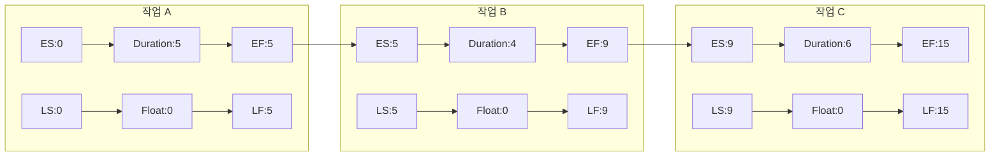

# 금융 SNS 서비스

- SNS를 활용하여 금융 관련 정보를 제공하고, 사용자들이 금융에 대한 지식을 공유하거나 다양한 금융 서비스를 이용할 수 있는 플랫폼
- 금융 서비스의 접근성과 사용자 경험을 향상
- 고객과의 소통을 강화하고, 금융 상품 및 서비스의 홍보, 정보 제공, 실시간 고객 지원

### 주요 기능

- 금융 정보 공유
- 실시간 금융 뉴스 및 업데이트
- 금융 서비스 추천 및 리뷰
- 소셜 투자 플랫폼
- 고객 서비스 및 지원

# 시스템 개발 라이프 사이클(SDLC)

> 정보시스템을 개발하는 구조화된 단계적 방법
> 

## 1. 단계별 작업

1. 기획
    - 프로젝트를 정의하고 프로젝트 스코프를 설정한다.
    - 작업, 자원, 시간 계획을 수립한다.
2. 분석
    - 요구사항 파악
3. 설계
    - 기술적 아키텍처를 디자인
    - system model(erd)를 디자인
4. 개발
    - S/W, DB
5. 테스팅
    - 성능 평가 및 최적화
6. 설치
    - 사용자 문서 작성
    - 사용자들을 위한 traning 제공
7. 유지 및 보수
    - help desk 설치
    - 유지 보수를 위한 환경 제공

## 2. 프로젝트 평가 기준

- 가치사슬분석
- 조직전략과의 정렬
- 잠재적 이익
- 자원의 가용성
- 프로젝트 사이즈/시간
- 기술적 어려움/위험

## 3. 작업 분류 구조(WBS)

> 프로젝트에서 수행할 작업을 정의할 때 사용되는 활동 및 작업 목록
> 

**WBS techniques**

- Top-Down
- Bottom-Up
- Analogy
- Braninstorming

## 4. 주요 경로(Critical Path)

> 프로젝트를 끝내는 가장 긴 경로
> 
- 이 경로가 시간 안에 끝나지 않으면 프로젝트 기간이 늘어남
- 예상 작업시간에 기초해 프로젝트를 계획

### Critical Path의 시작과 종료 시간

각 작업은 다음과 같은 4가지 시간 요소를 가집니다:

- **ES (Early Start):** 작업을 시작할 수 있는 가장 빠른 시간
- **EF (Early Finish):** 작업을 완료할 수 있는 가장 빠른 시간
- **LS (Late Start):** 전체 프로젝트 지연 없이 작업을 시작할 수 있는 가장 늦은 시간
- **LF (Late Finish):** 전체 프로젝트 지연 없이 작업을 완료할 수 있는 가장 늦은 시간

### Float(여유) 시간

Float = LS - ES 또는 LF - EF로 계산

- **Zero Float:** Critical Path 상의 작업들은 여유 시간이 0
- **Positive Float:** 작업이 지연될 수 있는 여유 시간이 있음
- **Negative Float:** 프로젝트 기한을 맞추기 위해 일정 단축이 필요함

# 시스템 요구사항

## 1. 유즈 케이스 다이어그램(Use Case Diagram)

> 사용 사례와 액터와의 관계를 그래픽으로 보여주는 UML모델
> 

시스템 경계(System Boundary)

행위자(Actors)

주요 행위자(Primary actor)

지원 행위자(Supporting actor)

### Use Case

- **연관관계** - 액터와 유즈케이스를 연결
- **일반화 관계** - 유즈케이스는 다른 유즈케이스의 특별한 버전(자식 유즈케이스는 부모 유즈케이스의 행동, 의미를 상속)
- **포함 관계** - 유즈케이스가 다른 유즈케이스의 일부
- **확장 관계-** 다른 핵심 유즈케이스의 행동

예시

- 온라인 쇼핑몰 시스템
    - 행위자: 고객, 관리자
    - 사용사례:
        - 상품 검색
        - 상품 추가
        - 결제 처리
        - 주문 확인

## 2. 클래스 다이어그램(Class Diagram)

> 클래스 다이어그램은 객체 지향 시스템의 정적 구조를 표현하는 UML 다이어그램
> 

### 구성요소

- **클래스(Class):** 객체의 속성과 메서드를 포함하는 템플릿
    - 클래스명
    - 속성(Attributes)
    - 메서드(Methods)
- **관계(Relationships):**
    - 연관(Association): 클래스 간의 일반적인 관계
    - 집합(Aggregation): 전체와 부분의 관계
    - 합성(Composition): 강한 집합 관계
    - 상속(Inheritance): 일반화/특수화 관계
    - 의존(Dependency): 일시적인 사용 관계

### 가시성(Visibility)

- **+ Public:** 모든 클래스에서 접근 가능
- **- Private:** 해당 클래스 내에서만 접근 가능
- **# Protected:** 해당 클래스와 상속받은 클래스에서 접근 가능

## 3. 활동 다이어그램

> 시스템이나 비즈니스 프로세스의 워크플로우를 시각적으로 표현하는 UML 다이어그램
> 

### 주요 구성요소

- **시작 노드:** 프로세스의 시작점을 나타냄
- **액티비티:** 실행되는 구체적인 작업이나 동작을 표현
- **결정 노드:** 조건에 따른 흐름의 분기를 나타냄
- **병합 노드:** 여러 흐름이 하나로 합쳐지는 지점
- **포크/조인:** 병렬 처리의 시작과 종료를 표현
- **종료 노드:** 프로세스의 종료점을 나타냄

### 사용 목적

- 복잡한 비즈니스 프로세스의 시각화
- 시스템의 동적 행위 모델링
- 병렬 처리와 조건부 처리의 표현

## 4. 시퀀스 다이어그램

> 시간 순서대로 정렬된 개체 상호 작용을 표시
> 

# 테스팅

## 1. 테스트 케이스

> 테스트 케이스는 소프트웨어가 의도한 대로 동작하는지 확인하기 위한 입력값, 실행 조건, 예상 결과를 포함하는 테스트 항목
> 

### 테스트 케이스 구성요소

- **테스트 조건:** 테스트하고자 하는 기능이나 상황
- **입력 데이터:** 테스트를 실행하기 위한 구체적인 입력값
- **예상 결과:** 테스트 실행 후 기대되는 결과나 동작
- **실제 결과:** 테스트 실행 후 실제로 발생한 결과

### 테스트 케이스 작성 원칙

- **명확성:** 테스트 단계와 예상 결과가 명확해야 함
- **재현 가능성:** 동일한 조건에서 항상 같은 결과가 나와야 함
- **추적 가능성:** 요구사항과 연계되어 추적이 가능해야 함
- **독립성:** 각 테스트 케이스는 서로 독립적이어야 함

## 2. 테스팅 종류

### 유닛 테스트

### 수용 테스트

### 알파 테스트

### 성능 테스트

### 부하 테스트

### 베타 테스트

## 3. 소프트웨어 테스팅 도구

> 반복적인 테스트를 자동화하여 테스트 시간을 단축하고, 사람의 실수 가능성을 줄일 수 있음
> 
- **JUnit:** Java 프로그래밍 언어를 위한 유닛 테스트 프레임워크로, 단위 테스트 자동화에 사용
- **Selenium:** 웹 애플리케이션 테스트 자동화 도구로, 브라우저 기반 테스트 수행
- **Jenkins:** 지속적 통합(CI) 도구로, 자동화된 빌드와 테스트를 지원
- **Apache JMeter:** 성능 테스트 도구로, 부하 테스트와 성능 측정에 활용
- **SonarQube:** 코드 품질 분석 도구로, 코드 품질 메트릭스와 버그 탐지 기능 제공
- **Postman:** API 테스트 도구로, RESTful API의 테스트와 문서화를 지원
